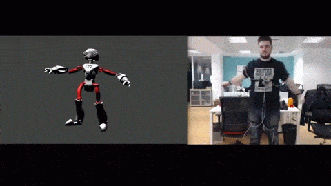
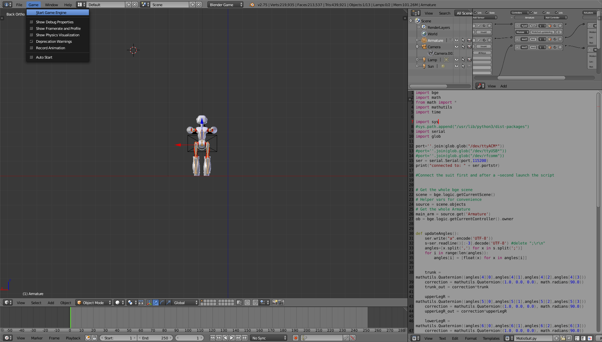

# MotioSuit

<a href="https://www.youtube.com/watch?v=JddtxynTgLk" target="_blank">Full video here</a>

The suit uses [BNO055 boards](https://github.com/bqlabs/BNO055) in each joint, with one or two sensors per I2C bus, and an [I2C multiplexer](https://github.com/bqlabs/I2C-multiplexer
) to switch between buses. It connects over bluetooth to a [BT to USB bridge module](https://github.com/bqlabs/BT-USB), which enables communication between the suit and the computer.

The Blender folder contains two blender files and a python script. "MotioSuit.blend" is ready to be used, while "Armature.blend" contains the skeleton and logic but not the model, so other characters may be controlled.

To start the program press on "Start Game Engine". Optionally, press on "Record Animation" to record the session.

Both python 3 and pyserial need to be installed for the communication to work.

### License

The code is shared under GPL v2
 

Every thing else is licensed under Creative Commons Attribution-ShareAlike
 

